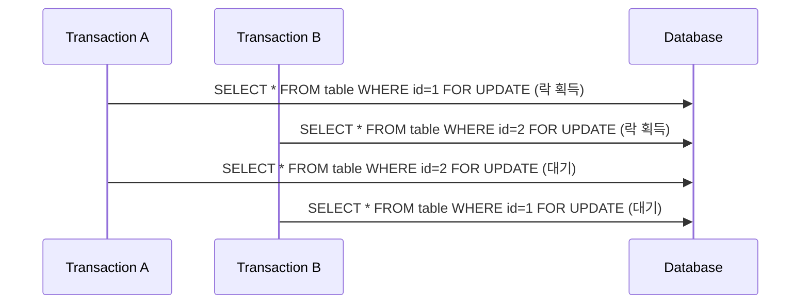

# 1. Lock 전략
동시성 환경에서는 여러 트랜잭션이 동시에 같은 데이터에 접근할 수 있기 때문에, 정합성을 보장하기 위해 **락(Lock)** 전략이 필요하다.

락 전략은 크게 두 가지 수준(Level)으로 분류할 수 있다.
- 데이터베이스 수준
    - 낙관적 락(**Optimistic Lock**)
    - 비관적 락(**Pessimistic Lock**)
- 시스템 아키텍처 수준
    - 분산락(**Distributed Lock, ex. Redis, ZooKeeper 등**)
    - 여러 인스턴스/서비스 간 리소스 충돌을 방지하기 위해 사용한다.

이번 포스팅에서는 JPA 관점에서 적용 가능한 **데이터베이스 수준의 락(낙관적락, 비관적 락)**을 중심으로 설명할 것이다.
분산락은 MSA 환경에서 중요한 주제이므로, 별도의 포스팅에서 다룰 예정이다.

# 2. 낙관적 락 (Optimistic Locking)
**'충돌은 드물다'**

**낙관적 락**은 변경이 거의 없는 읽기 중심의 데이터에서 주로 사용한다. 락을 미리 걸지 않고 데이터를 수정한 뒤, **커밋 시점에 충돌 여부를 검사**하는 방식이다.

## 2.1. 동작방식
1. 데이터를 조회할 때 `version` 필드를 읽어온다.
2. 트랜잭션 내에서 데이터를 수정한다.
3. 커밋 시점에 JPA는 `UPDATE ... WHERE id = ? AND version = ?` 쿼리를 실행한다.
4. version 이 일치하지 않으면 업데이트 건수가 0건 -> 예외발생 -> 롤백

## 2.2. JPA 예시
```java
@Entity
public class Product {
    @Id
    private Long id;

    private String name;

    @Version    // 낙관적 락을 위한 버전 필드
    private Long version;
}
```
```sql
-- JPA가 생성하는 UPDATE 쿼리
UPDATE product 
SET name = ?, version = version + 1 
WHERE id = ? AND version = ?
```

## 2.3. 장점
- 높은 동시성: **락을 걸지 않음** -> 다수의 트랜잭션 동시 접근 가능
- 성능 우수: 락 대기 시간이 없고, 데이터베이스 부하가 적다.
- 충돌이 드문 읽기 중심 환경에 적합하다.

## 2.4. 단점
- 충돌 발생 시 반드시 재시도 로직이 필요하다.
- 충돌 빈도가 높은 환경에는 부적합 (트랜잭션 실패율이 높을수록, 재시도 부하가 높다.)


# 3. 비관적 락 (Pessimistic Locking)
**'충돌은 빈번하다'**

**비관적 락**은 계좌, 재고, 송금 등 수치나 상태가 민감하고 충돌이 자주 발생하는 쓰기 중심의 데이터에서 사용한다. 데이터를 읽는 시점부터 DB에 락을 걸어 다른 트랜잭션이 동시에 접근하지 못하게 한다.

## 3.1. 동작방식
1. `SELECT ... FOR UPDATE` 같은 쿼리로 대상 행(Row)에 락을 건다.
2. 트랜잭션 내에서 데이터를 수정한다.
3. 트랜잭션이 커밋/롤백되면 락이 해제된다

## 3.2. JPA 예시
```java
@Lock(LockModeType.PESSIMISTIC_WRITE)
@Query("SELECT p FROM Product p WHERE p.id = :id")
Product findByIdForUpdate(@Param("id") Long id);
```
### 3.2.1. LockModeType 종류
- `PESSIMISTIC_READ`: 공유 락. 읽기만 허용, 다른 쓰기 차단 (실무에서는 거의 사용하지 않음)
- `PESSIMISTIC_WRITE`: 배타적 락. 읽기/쓰기 모두 차단. 가장 많이 사용한다.
- `PESSIMISTIC_FORCE_INCREMENT`: 비관적락 + 버전 필드 강제 증가. 낙관적 락과 혼합하여 사용한다.

## 3.3. 장점
- **충돌 방지**: 트랜잭션이 완료될 때까지 다른 트랜잭션이 접근하지 못한다.
- **정합성 보장**: 중요한 데이터의 일관성 유지
- **충돌이 빈번한 쓰기 중심 환경**에 적합하다.

## 3.4. 단점
- **낮은 동시성**: 락이 걸린 동안 다른 트랜잭션은 대기해야 한다.
- **성능 저하**: 락 대기 시간 증가 및 데이터베이스 부하 증가.
- **교착 상태(Deadlock)** 발생 가능.

## 3.5. 교착 상태(Deadlock) 
### 3.5.1. 교착 상태란?
서로 다른 트랜잭션이 교차로 자원을 점유하면 데드락이 발생할 수 있다.

예시: 트랜잭션 A가 row1을 점유(락), 트랜잭션 B가 row2를 점유한 상태에서, A는 row2,  B는 row1을 요청 -> 서로 대기 상태에 빠짐 -> 데드락 발생



### 3.5.2. 교착 상태 방지전략
- 트랜잭션의 **락 획득 순서를 일관되게 유지**한다.
    ```java
    // 항상 id 오름차순으로 락 획득
    Product p1 = productRepository.findByIdForUpdate(id1);
    Product p2 = productRepository.findByIdForUpdate(id2);  
    ```

- 트랜잭션 시간을 최소화하여 **락 유지 시간을 줄인다**.
    ```java
    // 트랜잭션 시간 최소화 예시
    @Transactional
    public void updateProductStock(Long productId, int quantity) {
        Product product = productRepository.findByIdForUpdate(productId);
        product.setStock(product.getStock() - quantity);
        productRepository.save(product);
    }
    ```

- **락 타임아웃 설정**을 통해 DB 무한대기를 막고, 교착 상태를 감지.
    ```properties
    spring.jpa.properties.hibernate.lock.timeout=5000  # 5초
    ```

## 3.6. 비관적 락 사용 시 추가 고려사항
- DBMS에 따라 `SELECT ... FOR UPDATE`의 동작이 다를 수 있다.
    - `MySQL InnoDB` 에서는 인덱스를 타지 못하면 `FOR UPDATE`가 테이블 전체에 락을 건다.
    - `PostgreSQL`은 인덱스를 타지 못해도 행 단위 락을 건다.

# 4. 락과 재시도 패턴
낙관적락/비관적락 모두 결국은 재시도 로직 없이는 안전하지 않다. 락 충돌, 교착 상태, 타임아웃 등으로 인해 트랜잭션이 실패할 수 있기 때문이다. 따라서 재시도 패턴을 반드시 구현해야 한다.

## 4.1. 낙관적 락과 재시도
낙관적 락은 충돌 시점에 예외가 발생하므로, 재시도 로직이 필수적이다. 재시도 패턴은 다음과 같이 구현할 수 있다.

- `@Version` 충돌 시 OptimisticLockException -> 트랜잭션 재시도
    ```java
    for (int i = 0; i < MAX_RETRIES; i++) {
        try {
            // 트랜잭션 내에서 데이터 수정
            productService.updateProduct(id, newName);
            break; // 성공 시 루프 종료
        } catch (OptimisticLockFailureException e) {
            // 재시도 로직 (ex. 로그 남기고 다시 시도)
            log.warn("Optimistic lock exception occurred, retrying...", e);
        }
    }
    ```

## 4.2. 비관적 락과 재시도
비관적 락은 교착 상태나 타임아웃으로 인해 예외가 발생할 수 있다. 이 경우에도 재시도 로직이 필요하다.

- DeadlockLoserDatabaseException -> 트랜잭션 재시도
- DBMS마다 락 해제 시점이나 타임아웃 정책이 다르므로, 재시도 횟수/간격을 환경에 맞게 조정해야 한다.
    ```java
    for (int i = 0; i < MAX_RETRIES; i++) {
        try {
            // 트랜잭션 내에서 데이터 수정
            productService.updateProduct(id, newName);
            break; // 성공 시 루프 종료
        } catch (DeadlockLoserDatabaseException e) {
            // 재시도 로직 (ex. 로그 남기고 다시 시도)
            log.warn("Deadlock occurred, retrying...", e);
        }
    }
    ```

# 5. TypeORM의 Lock 전략
TypeORM은 JPA처럼 `@Version` 필드나 `@Lock` 어노테이션이 있는 이이  것아니라, **쿼리 빌더(QueryBuilder)**에서 락 옵션을 직접 지정하는 방식으로 동작한다

## 5.1. 낙관적 락
- `optimistic` 모드를 지정하고, 버전 번호를 함께 확인한다.
    ```typescript
    await dataSource
        .getRepository(Product)
        .createQueryBuilder('p')
        .setLock('optimistic',  version)    // version 값 검증
        .where('p.id = :id', { id })
        .getOne();
    ```

## 5.2. 비관적 락
- `pessimistic_read`, `pessimistic_write` 등의 모드를 지정한다.
- DB에 따라 `FOR UPDATE` 또는 `LOCK IN SHARE MODE` 쿼리로 변환된다.
    ```typescript
    await dataSource
        .getRepository(Product)
        .createQueryBuilder('p')
        .setLock('pessimistic_write')   // SELECT ... FOR UPDATE
        .where('p.id = :id', { id })
        .getOne();
    ```

## 5.3. 특징
- JPA와 달리 전용 어노테이션이나 전파옵션은 없다.
- 모든 락 지정은 **QueryBuilder** 수준에서만 가능하다.
- 결국 락 충돌 시 재시도 로직은 개발자가 직접 구현해야 한다.

# 6. 결론
락 전략은 단순히 충돌을 막는 장치가 아니라, 트랜잭션 안정성과 시스템 성능의 균형을 맞추는 핵심 도구다.
- 낙관적 락은 읽기 위주 환경에서 성능을 높여주지만, 충돌 시 재시도가 필수적이다.
- 비관적 락은 쓰기 충돌을 확실히 막아주지만, 교착 상태, 성능 저하를 피하기 위한 관리가 필요하다.
- TypeORM 은 QueryBuilder 수준에서만 락을 지원하며, JPA처럼 추상화된 옵션은 없으므로 재시도 로직을 개발자가 직접 책임져야 한다.

결국 중요한 것은 **도메인 특성에 맞는 전략선택**이다. 

**충돌이 드문 환경에서는 낙관적 락**을 두는 것이 효율적이다. 예를 들어, 사용자 프로필 수정이나 KYC 정보 갱신처럼 동시에 변경될 가능성이 낮은 데이터에서는 성능 저하 없이 안정적으로 정합성을 확보할 수 있다.

반대로 계좌 잔액차감, 송금처리, 결제 승인과 같이 **정합성이 흔들리면 치명적인 결과로 이어지는 영역에서는 비관적 락**이 적합하다.

그리고 **멀티 인스턴스 환경에서의 송금 한도 관리나 동시 결제 요청 같은 시나리오**에서는 데이터베이스 수준의 락만으로는 한계가 있어, **시스템 수준의 분산락**을 고려해야 한다.

궁극적으로**충돌패턴과 도메인 요구사항을 정확히 이해하고, 그에 맞는 락 전략을 선택하는 것**이 안정적인 시스템 설계의 핵심이다.
